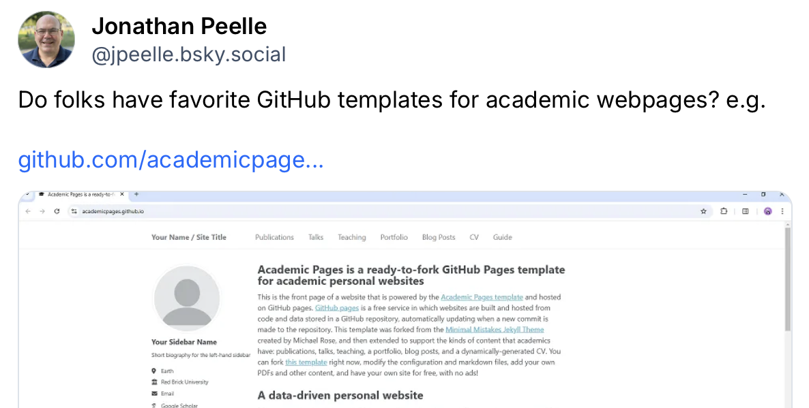

##

 - What is the right time to build a personal website, and how do you do it?
 - Is social media ever useful professionally?
 - How can you network as effectively as possible in a way that feels comfortable?


## Caveats

 - Everyone has opinions
 - Find what works for you
  


## What goals do you have for your online presence?

. . .

 - Job search
 - Research visibility
 - Teaching visibility
 - Public engagement
 - Finding community
 - Learning from others
 - Participant recruitment
  

## What audiences do you have for your online presence?

. . .

 - Students
 - Colleagues
 - Collaborators
 - Funders
 - The public
 - Other professional audiences


## Start here

As an academic you should have:

1. A personal website with a stable URL
2. A completed LinkedIn profile
3. A Google Scholar profile (as soon as you have 1 publication)

Whether it's worth going beyond these depends on your personal goals.


## Your current online presence

- Try typing your name into Google. If you are not the first result, you have work to do.
- Both web search and LLMs make use of available documents on the web. It's not magic. If you don't like what you see about yourself, work to change it.


## Considerations

- If you have a common name, use your middle initial---or write out your full middle name---consistently (not just on papers, but on your website, CV, social media, etc.).
- If you don't have a middle name, you may want to adopt one.
- The more places your name appears in relation to what you want to be known for, the better. One website is better than zero; 20 is better than one.


## LinkedIn

 - Complete your profile, targeting the audiences you want to reach
   - If you are looking for a job in industry you may want to highlight project management experience or coding.
 - Keep your information current!
 - Build some kind of network
 - Consider posting to promote your work, colleagues' work, etc.

 


## Website requirements

::: {.incremental}
- Have information your audience cares about
- Under your control
- Stable URL (independent of institution)
- Easy to update
:::

## Website options

::: 
- [Squarespace][1]
   - Intuitive editing
   - Generally looks good
   - Costs money
- [GitHub Pages][2]
   - Intuitive editing...*if you are comfortable with markdown type languages and git workflow*
   - Can look good
   - Free
- Other: Quarto, Rmarkdown, etc.
:::

[1]: http://www.squarespace.com/
[2]: https://pages.github.com/


## Themes for GitHub pages

- <https://academicpages.github.io>
   - Step-by-step instructions provided


## Academicpages: edit yaml and md text files

```{.yaml}
# Basic Site Settings
locale             : "en-US"
site_theme         : "mint"
title              : "Your online academic presence"
title_separator    : "-"
name               : &name "Jonathan Peelle"
description        : &description "Professor Peelle's Portfolio"   
url                : https://jpeelle.github.io 
                                                      

author:
  avatar           : "profile.png"
  name             : "Jonathan Peelle"
  pronouns         : "he/him"  
  bio              : "Smart and handsome professor"
  location         : "Boston, MA"
  employer         : "Northeastern University"
  uri              : "http://jonathanpeelle.net"
```


## Hosting vs. domain

- A website *host* is where your content lives
- A *domain* is what you would type in the address bar (e.g., jonathanpeelle.net). You can change which host the domain points to in the future.
- Regardless of where you host your website, having a domain is nice (and often only about $20/year)
   - I use Hover. Save $2: <https://hover.com/xFYiu13a>


## Website content

 - Think about your goals and likely audiences
 - Be inspired by people you look up to in your desired profession
 - At minimum:
   - A short bio or introduction
   - A CV
   - A list of publications
   - Contact information


## Other social media

 - Different platforms have different audiences and can serve different purposes
   - Bluesky
   - Mastodon
   - Instagram
   - etc.

## 

. . .

{width=80%, fig-align="center"}


:::aside
<https://bsky.app/profile/jpeelle.bsky.social/post/3mtpomft3ic2n>
:::

##

::: {style="font-size: 2em;color:white"}
Like most of life, what you get out of a thing relates to how much time and effort you put in.
:::


## Questions?